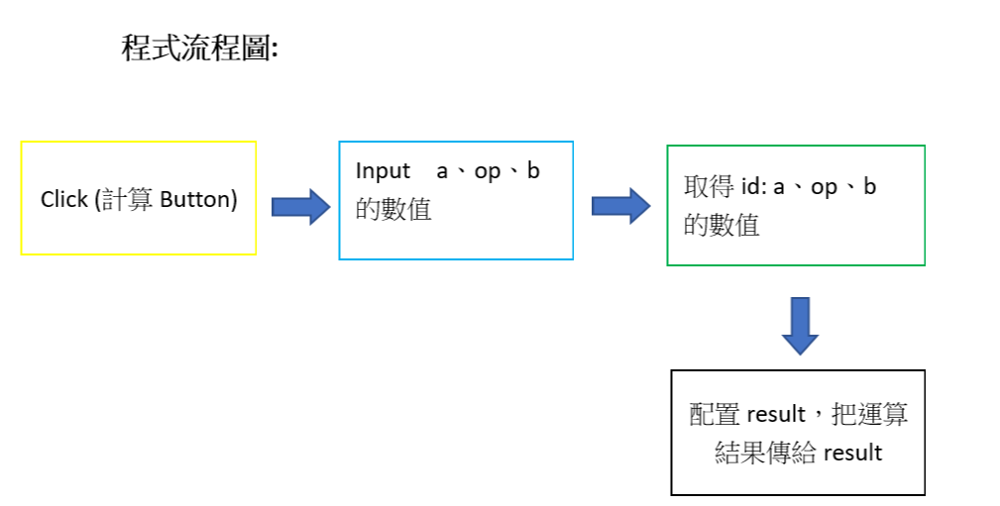

學習要點：

document.getElementById(‘id’)：
把特定id內的元素提出來使用，var a = document.getElementById('a') 等於是var a = (value="3")

eval()：可以執行某一段字串的運算，如果該字串是運算式，則 eval 會計算出運算結果。  
PS C:\Users\Nick\Desktop\wp108b\homework\wp\code\05-js> node  
> x = 1  
1  
>  y =2  
2  
> y + x  
3  
> eval('x+y')  
3         <--eval(字串)  
> 'x+y'  
'x+y'      <--只有字串
