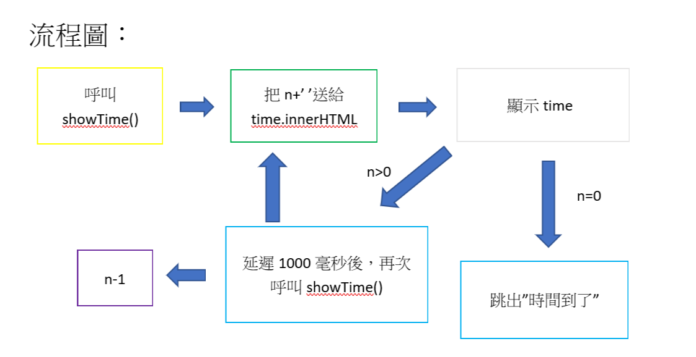

學習要點：  

這個計時器程式跑到n=1會先跳出”時間到了”再跳出n=0，重點在於  
alert("時間到了")會比n=0要早出現，如果要改成先n=0再跳”時間到了”，就把if(n===0)  
改成if(n===-1)，這樣就是n=0再跳”時間到了”後跳n=-1，可我們也不想要-1，這時再把  
document.getElementById("time").innerHTML=n+'';移到else {}當中，問題就解決了。

.png)
